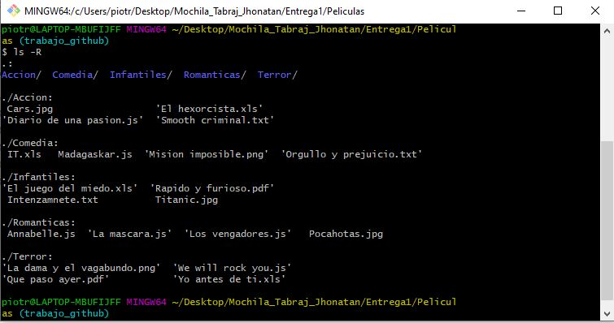
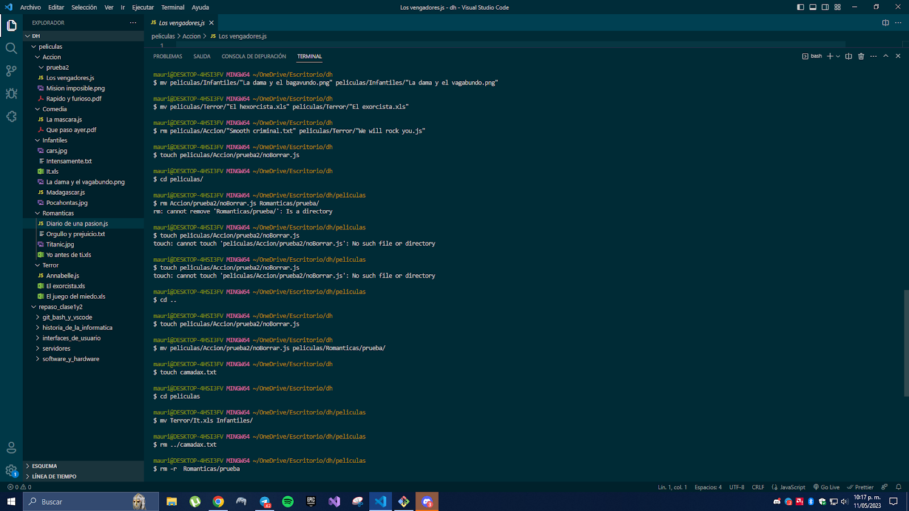

# Validando Resultados

## Una vez realizada la actividad deberemos corroborar el resultado obtenido, ubicándonos en la carpeta peliculas y utilizando el comando: ls -R



## Si el resultado coincide con la plantilla guía de la diapositiva anterior resolver las siguientes preguntas

- ¿Se pueden crear las carpetas del punto 2 en un solo comando? En caso que la respuesta sea positiva escribir el comando.

```
$ touch "Madagaskar.js" "Orgullo y prejuicio.txt" "It.xls" "Mision imposible.png"
```

- ¿Se pueden crear los archivos del punto 3 en un solo comando? En caso que la respuesta sea positiva escribir el comando.

```
$ touch "Madagaskar.js" "Orgullo y prejuicio.txt" "It.xls" "Mision imposible.png
```

- Estando ubicados en la carpeta DH crear una carpeta llamada Prueba dentro de la carpeta Romanticas en un solo comando y escribirlo aquí.

```
$ mkdir peliculas/romanticas/prueba
```

- Estando ubicados en la carpeta Romanticas crear una carpeta llamada Prueba2 dentro de la carpeta Accion

```
$ mkdir ../accion/prueba2
```

## Integrando en VSC


